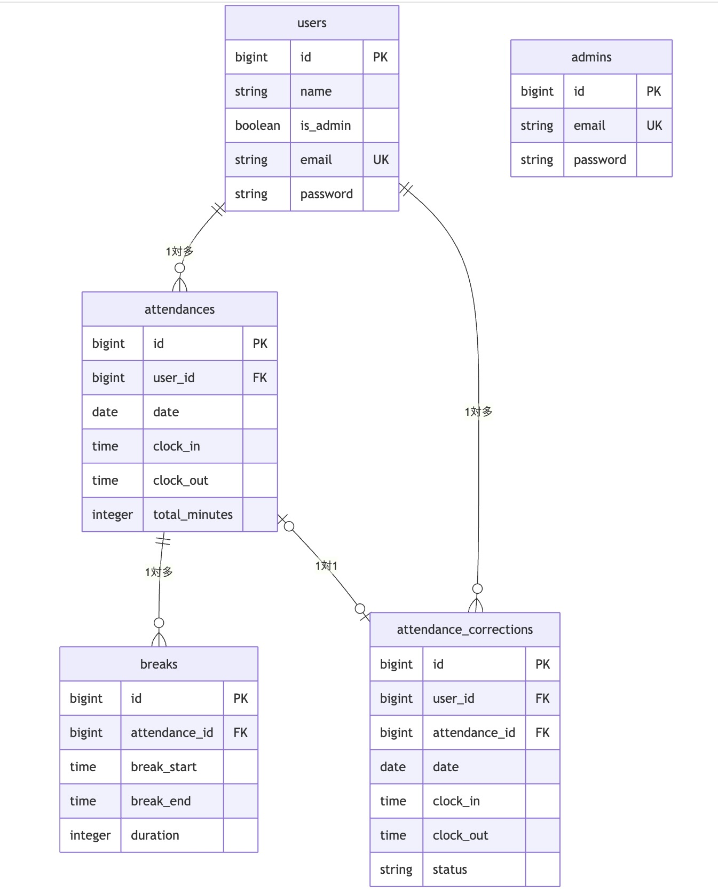

# 勤怠管理システム

## 環境構築

### Dockerビルド
- git clone <https://github.com/ayana0331/attendance-app.git>
- docker-compose up -d --build

### Laravel環境構築
- docker-compose exec php bash
- composer install
- cp .env.example .env # 環境変数を必要に応じて変更
- php artisan key:generate
- php artisan migrate
- php artisan db:seed

### メール送信設定（Mailtrap）
`.env` ファイルに以下の設定を追加してください。

```bash
MAIL_MAILER=smtp
MAIL_HOST=sandbox.mailtrap.io
MAIL_PORT=2525
MAIL_USERNAME=あなたのMailtrapユーザー名
MAIL_PASSWORD=あなたのMailtrapパスワード
MAIL_ENCRYPTION=null
```

### 使用技術
- 言語: PHP 8.4.14
- フレームワーク: Laravel 12.37.0
- データベース: MySQL 8.0.26
- 認証: Laravel Fortify
- メール認証: Mailtrap


## ER図



## URL (開発環境)
- ログイン(一般ユーザー) http://localhost/login
- ユーザー登録 http://localhost/register
- ログイン(管理者) http://localhost/admin/login

## テスト用アカウント
動作確認用に以下の初期データを作成しています。

### 一般ユーザー（従業員）
- **メールアドレス**: `reina.n@coachtech.com`
- **パスワード**: `password`

### 管理者
- **メールアドレス**: `admin@example.com`
- **パスワード**: `password`
